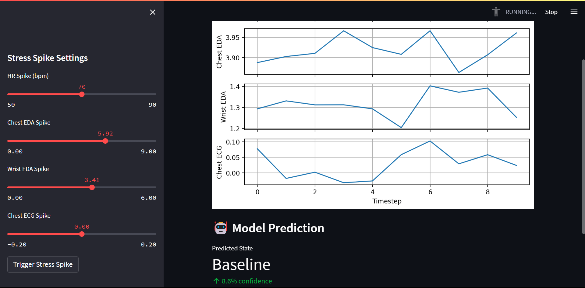
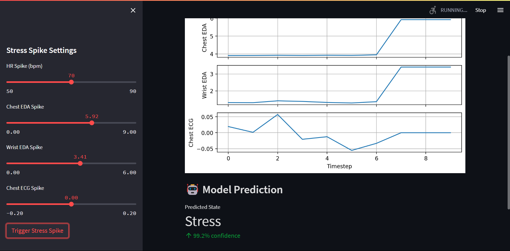
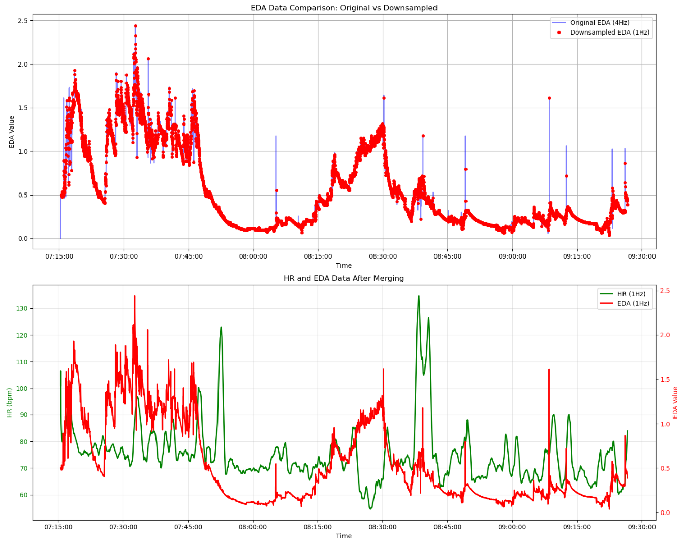
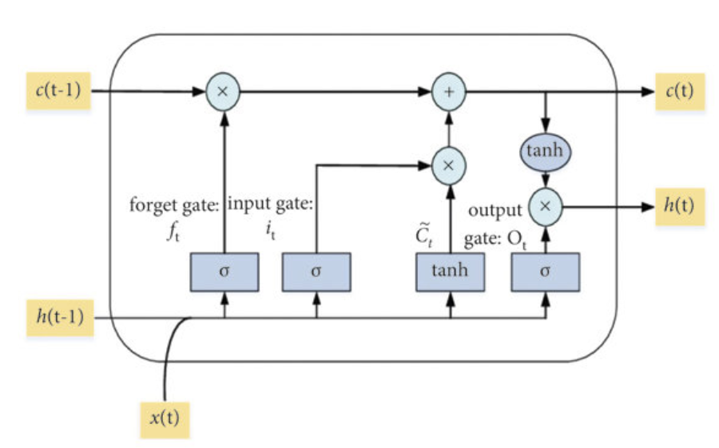
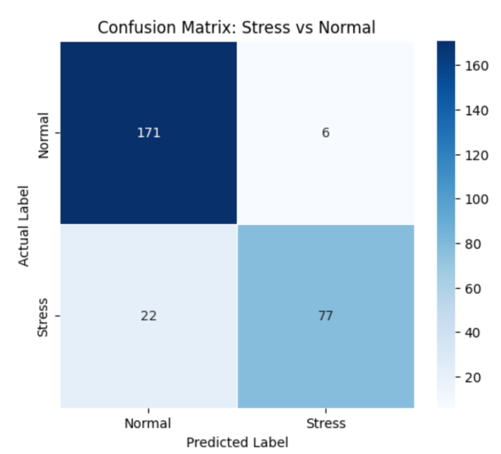
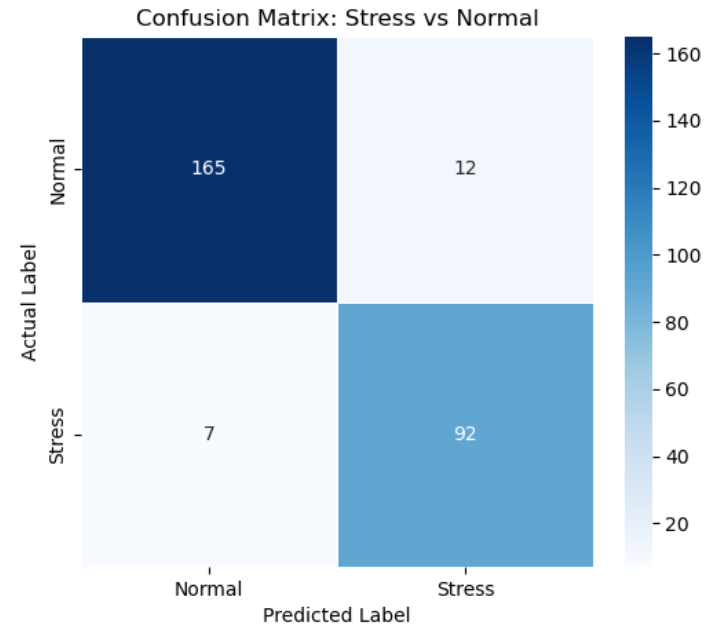

## Zenflow: AI powered real time stress monitoring and prediction using EEG and ECG 

### Jayant Sharma, Hannah Manheimer, Yifan Wang, Sami Smayra
### Projects in Biomedical AI - Spring 2025

### Introduction
This project aims to create a machine learning-based system that can detect and predict stress levels in real time using physiological data collected from wearable sensors.
We focus on two primary biosignals: heart rate (HR), derived from electrocardiography (ECG)[3], and electrodermal activity (EDA), both of which are directly related to the autonomic nervous system’s stress response. Using the WESAD dataset [4], a well-established multimodal dataset containing HR and EDA signals from wearable devices, we trained and evaluated three models: a long-short-term memory (LSTM) neural network model, Random Forest, a hybrid LSTM-Fully Convolutional Network (LSTM-FCN) to classify current stress states and forecast future ones in a simulated real-time setting. This report presents the motivation behind the development of ZenFlow,
describes the data sources and processing methods used, the model architecture and evaluation metrics, and discusses the broader significance and impact of our findings in the context of wearable health technologies and personalized stress prediction.

## Real Time Stress detection

           

A real time interface with the trained model is provided, which uses Streamlit to simulate ECG and EDA signals from a subject. Users can trigger a stress spike, which initiates an elevated state of stress by simulating the signals accordint to the dataset. 

### Dataset
The WESAD (Wearable Stress and Affect Detection) dataset is a publicly available multimodal benchmark designed for research on automatic stress and emotion recognition from wearable sensors. The WESAD dataset supplies chest and wrist worn physiological signals for 15 graduate students in Germany, exposed to baseline, amusement, meditation and Trier Social Stress Test conditions. Chest data (ACC, ECG, EDA, EMG, RESP, TEMP) were sampled at 700 Hz with a RespiBAN Professional strap, while the Empatica E4 wristband provided ACC (32 Hz), BVP (64 Hz), EDA (4 Hz) and skin temperature (4 Hz) and average heart rate (1 Hz) extracted from the BVP signal.

### Model descriptions:

#### 1. Random Forest Classifier 
The model consisted of 100 trees, each limited to a maximum depth of 2, with minimum splits of 10 samples and a minimum of 5 samples per leaf. We used the square root of the total number of features for node splitting and enabled out-of-bag (OOB) evaluation to estimate generalization performance.

#### 2. Long Short Term Memory (LSTM)
The model was trained on sequences of multichannel biosignals (definition and preprocessing details in the previous section) all sampled at 1Hz. Each input sequence represents a fixed-length window (e.g., 50 time steps), capturing recent temporal trends. The input to the model was thus batched in dimensions representing this approach, with the input data was in the form of a three dimensional tensor (batch size, sequence length, number of inputs. For example, for a 10 second data window, the input data
received by the LSTM was in the form of (32, 10, 4). The network processes these sequences and outputs a single logit indicating the probability of a stress state. The architecture is particularly well-suited for detecting patterns that unfold over time, such as gradual increases in HR or delayed EDA peaks associated with stress responses.

 

| Hyperparameter         | Value                                   |
|-------------------------|-----------------------------------------|
| Input size              | 4 (chest EDA, wrist EDA, ECG, HR)       |
| Hidden size (LSTM)      | 64                                      |
| LSTM layers             | 4                                       |
| Final FC size           | 64 (from last LSTM output)              |
| Output size             | 1                                       |
| Loss function           | Binary Cross Entropy with Logits        |
| Optimizer               | Adam                                    |
| Learning rate           | 0.001                                   |
| Batch size              | 32                                      |
| Sequence length         | variable from 10 to 120 seconds         |

#### 3. LSTM with Shortcut Connections
For the third model in our analysis, we adopted the LSTM-Fully Convolutional Network (LSTMFCN), because during our literature survey it consistently topped the time-series benchmarks while remaining much lighter than transformer-based alternatives. The architecture works like a two-lane highway: one lane is a three stage 1-D convolutional stack followed by global average pooling that excels at detecting instantaneous shape patterns in biosignals, such as a sudden electrodermal spike or a sharp heart rate dip, whereas the other lane is a 128-unit LSTM that scans the entire window to capture long range trends. Outputs from both lanes are concatenated and fed to a single dense
softmax layer that yields the posterior probabilities of stress versus normal.

| Hyperparameter      | Value                                     |
|----------------------|-------------------------------------------|
| FCN Conv1 layer      | 128 channels, kernel size 8               |
| FCN Conv2 layer      | 256 channels, kernel size 5               |
| FCN Conv3 layer      | 128 channels, kernel size 3               |
| Final FC layer       | 192 (LSTM output 64 + FCN output 128)     |

### Results

The LSTM-only model achieved an accuracy of 89%, precision of 90%, and F1-score of 84.4% on the held-out test set. These results suggest strong capability in identifying stress episodes from wearable biosignals. Epochs were set at 30 for both the models, and the loss curve showed a steady decrease, indicating no overfitting in either models.
On the held-out test set the LSTM-FCN achieved 93.1 % overall accuracy, confirming that nearly all time windows were classified correctly. More importantly, the class-balanced F1 score reached 0.906, with precision = 0.922 and recall = 0.931, indicating that the model detects stress episodes with both high confidence and very few misses. Together, these metrics confirm that the lightweight LSTM-FCN can deliver reliable, real-time stress recognition without sacrificing accuracy.

| Model                   | Accuracy | F1-Score |
|--------------------------|----------|----------|
| Random Forest Classifier | 74%      | 79%      |
| LSTM                     | 89%      | 84.4%    |
| LSTM + FCN               | 93.1%    | 90.6%    |

                            

### References

1. The American Institute of Stress. (2025, April 24). TEENS YOUNG ADULTS - The American Institute of
Stress. https://www.stress.org/who-gets-stressed/teens-young-adults/
2.  Steptoe, Andrew, and Mika Kivimäki. “Stress and cardiovascular disease.” Nature reviews. Cardiology vol.
9,6 360-70. 3 Apr. 2012, doi:10.1038/nrcardio.2012.45
3.  Zhang, P., Li, F., Du, L., Zhao, R., Chen, X., Yang, T., Fang, Z. (2021). Psychological Stress Detection
According to ECG Using a Deep Learning Model with Attention Mechanism. Applied Sciences, 11(6), 2848.
https://doi.org/10.3390/app11062848
4.  Philip Schmidt, Attila Reiss, Robert Duerichen, Claus Marberger and Kristof Van Laerhoven, "Introducing
WESAD, a multimodal dataset for Wearable Stress and Affect Detection", ICMI 2018, Boulder, USA, 2018
5.  F. Karim, S. Majumdar, H. Darabi and S. Chen, “LSTM Fully Convolutional Networks for Time-Series
Classification,” IEEE Access, vol. 6, pp. 1662-1669, 2018.
6.  S. Hochreiter and J. Schmidhuber, "Long Short-Term Memory," in Neural Computation, vol. 9, no. 8, pp.
1735-1780, 15 Nov. 1997, doi: 10.1162/neco.1997.9.8.1735.
